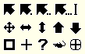

# plan9cursors

Plan9 style cursors for Hyprland (it should work in other setups too). Created using the [hyprcursors-util](https://github.com/hyprwm/hyprcursor) and xcursors theme from [wintermute-cell/xcursor-plan9](https://github.com/wintermute-cell/xcursor-plan9) (originally found on [π.duncano.de](https://xn--1xa.duncano.de/)).



## Installation

- Place `plan9cursors/` into `$XDG_DATA_HOME/icons/`.
- Place `plan9cursors-xcursors` into `/usr/share/icons/` (remove the '-xcursors' suffix first).
- Place the following snippet into your `hyprland.conf` file:
    ```hyprlang
    env = HYPRCURSOR_THEME,plan9cursors
    env = HYPRCURSOR_SIZE,24
    env = XCURSOR_THEME,plan9cursors
    env = XCURSOR_SIZE,24
    ```
- Run `gsettings set org.gnome.desktop.interface cursor-theme 'plan9cursors'`.

For more information about configuring cursors theme, consult:
- https://wiki.archlinux.org/title/Cursor_themes
- https://wiki.hyprland.org/Hypr-Ecosystem/hyprcursor/
- https://standards.hyprland.org/hyprcursor/

## Licence

This code (project) is licensed under the terms of the MIT Licence (see LICENCE for details).
